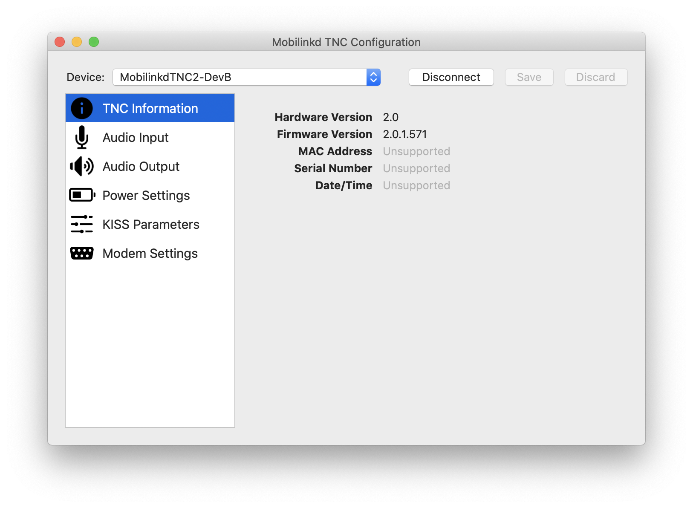
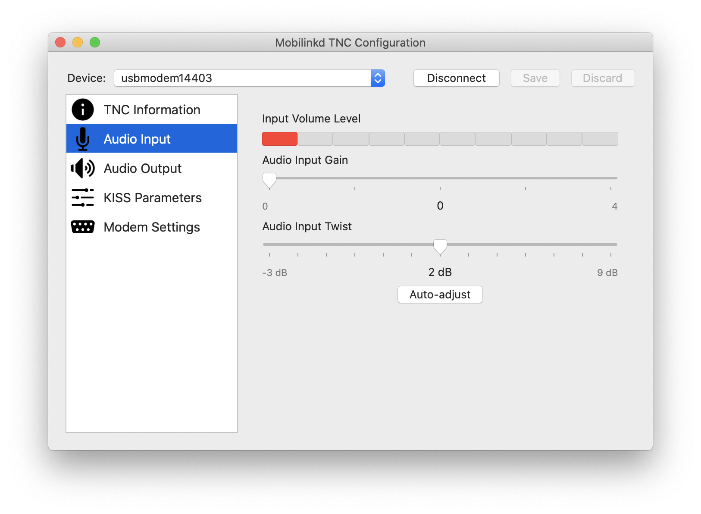
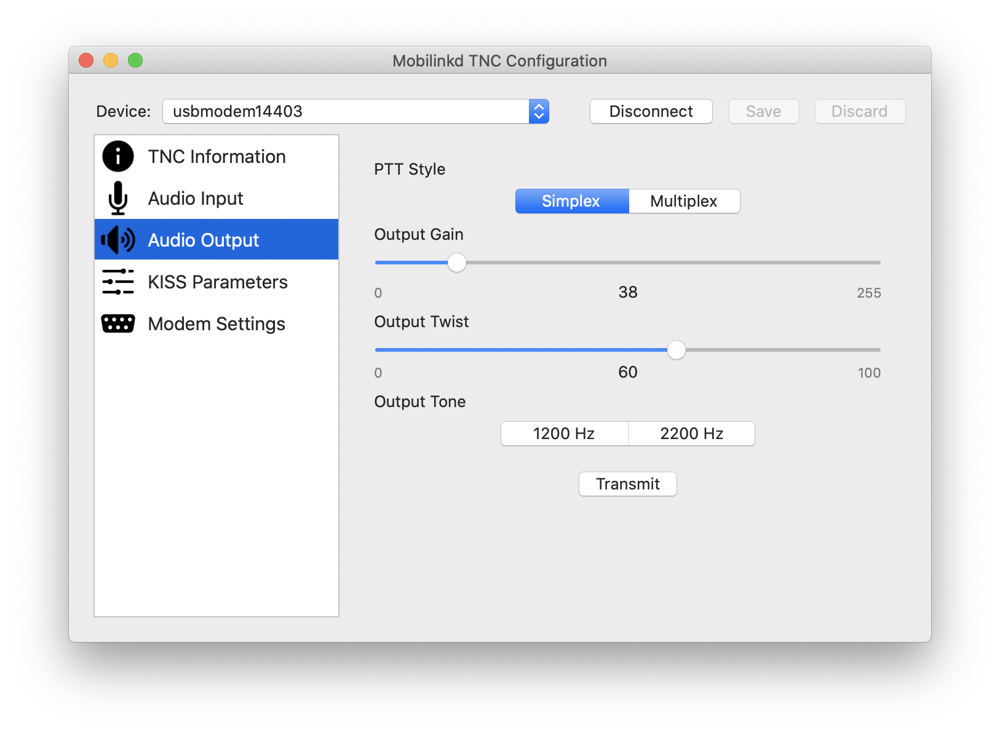
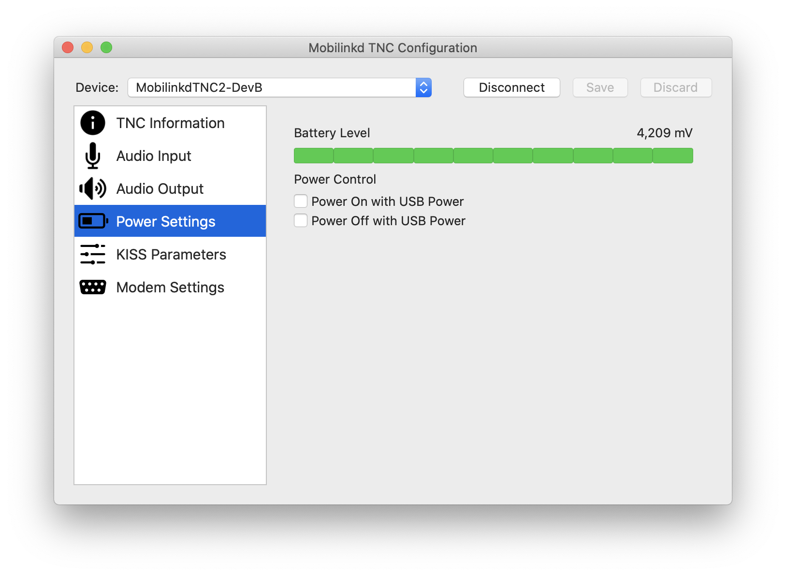
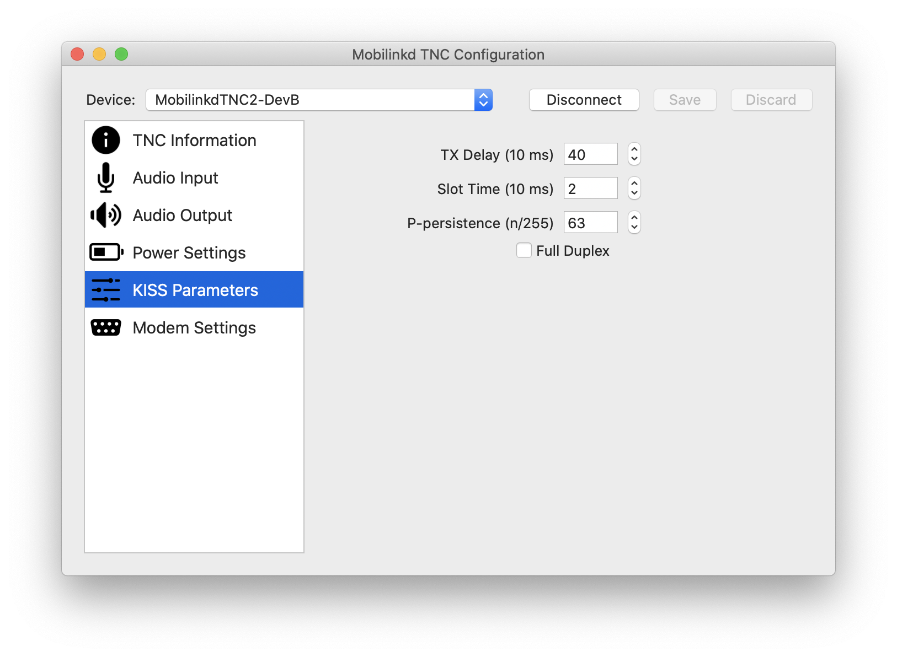
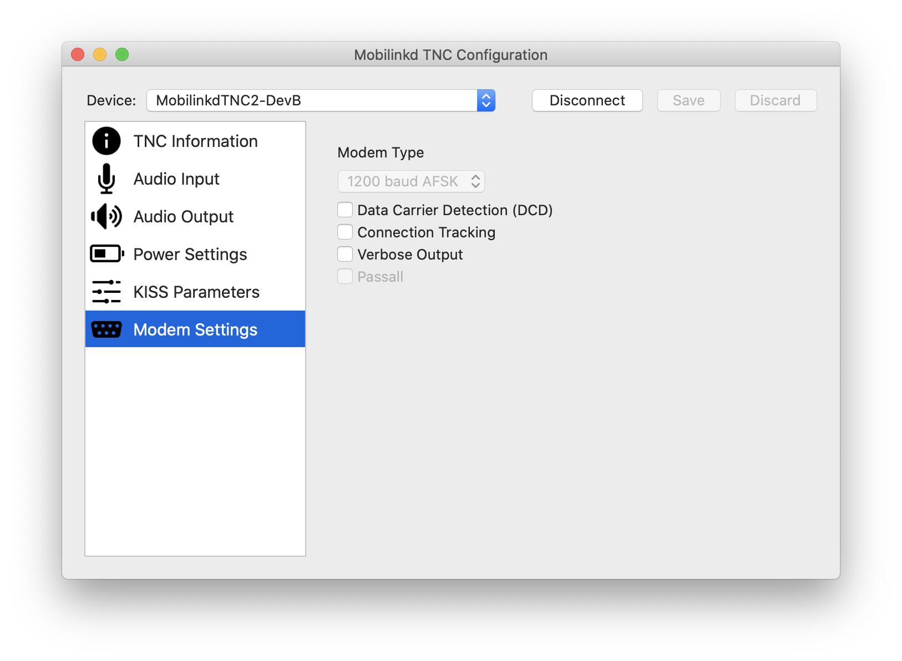

# MacTncConfig

Native macOS utility for configuring the [Mobilinkd family of TNCs](http://www.mobilinkd.com)

It allows one to monitor the input volume, adjust the output volume, set
the KISS parameters, and various other parameters of the Mobilinkd TNCs.

### Tested Devices

1. [TNC2](http://www.mobilinkd.com/tnc2/)
2. [NucleoTNC](https://nbviewer.jupyter.org/github/mobilinkd/NucleoTNC/blob/master/Build/NucleoTNC.ipynb)

### TODO
 * Support [TNC3](https://store.mobilinkd.com/products/mobilinkd-tnc3) Bluetooth protocol
 * Implement firmware update functionality

### Screenshots

### Installing

Download the disk image of the latest release and drag to Applications.

### Building

The project uses [Carthage](https://github.com/Carthage/Carthage) to pull down third-party Frameworks.

1. [Install Carthage](https://github.com/Carthage/Carthage#installing-carthage)
2. Run `carthage update --platform macOS --new-resolver`
3. Open `MacTncConfig.xcodeproj` with XCode
3. Product &rarr; Build